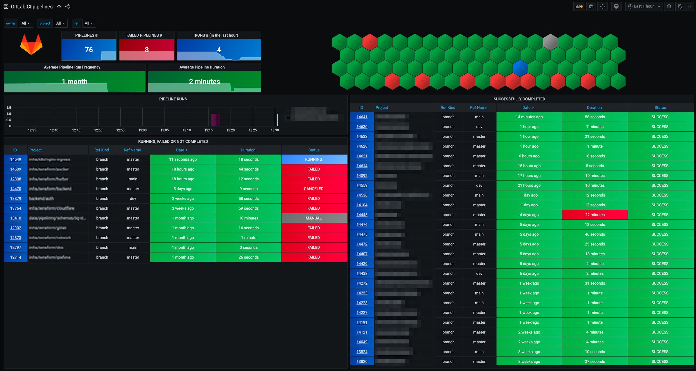
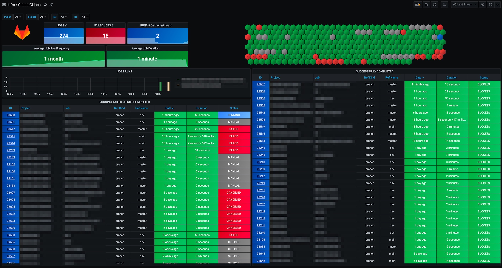
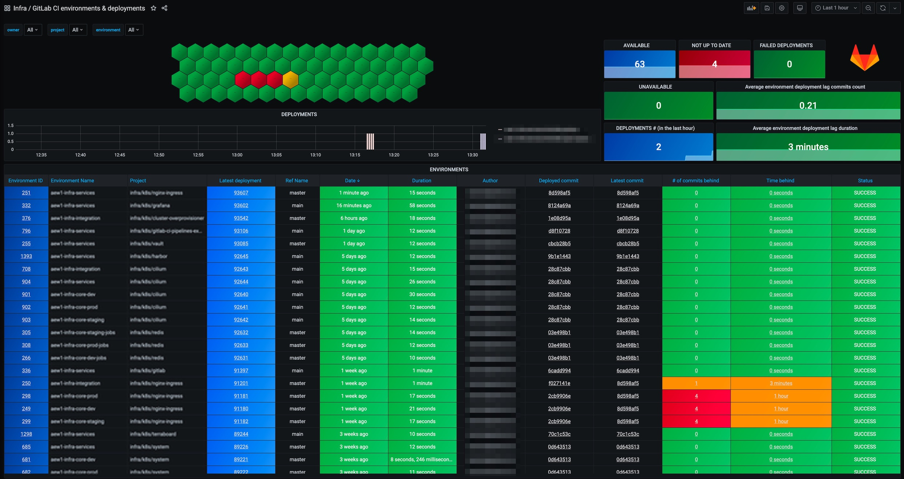

# gitlab-ci-pipelines-exporter
Global pipeline health is a key indicator to monitor along with job and pipeline duration. CI/CD analytics give a visual representation of pipeline health.
Instance administrators have access to additional performance metrics and self-monitoring.
You can fetch specific pipeline health metrics from the API. External monitoring tools can poll the API and verify pipeline health or collect metrics for long term SLA analytics.
gitlab-ci-pipelines-exporter allows you to monitor your GitLab CI pipelines with Prometheus or any monitoring solution supporting the OpenMetrics format.

**In this design, the GitLab CI pipelines exporter is deployed on the observability server and directly connected to Prometheus.**

**Compos Sample:**
```bash
version: "3.8"
networks:
  app_net:
    external: true
    name: app_net
services:
  gitlab-ci-pipelines-exporter:
    image: quay.io/mvisonneau/gitlab-ci-pipelines-exporter
    container_name: gitlab-ci-pipelines-exporter
    hostname: gitlab-ci-pipelines-exporter
    restart: ${RESTART_POLICY}
    command: run --config /etc/config.yml
    volumes:
      - ./gitlab-ci-pipelines-exporter.yml:/etc/config.yml
    networks:
      - app_net
```

**Gitlab ci pipelines exporter sample config:**
```bash
gitlab:
  url: <GITLAB_URL>
  token: <GITLAB_TOKEN>

wildcards:
  - owner:
      name: vote
      kind: group
      include_subgroups: true
    pull:
      environments:
        enabled: true
        exclude_stopped: false
      refs:
        branches:
          enabled: true
          exclude_deleted: true
        tags:
          enabled: true
        merge_requests:
          enabled: true
      pipeline:
        jobs:
          enabled: true
          from_child_pipelines:
            enabled: true
          runner_description:
            enabled: true
        variables:
          enabled: true
        test_reports:
          enabled: true
          from_child_pipelines:
            enabled: true
          test_cases:
            enabled: true
```

**Prometheus config sample:**
```bash
  - job_name: 'gitlab-ci-pipelines-exporter'
    scrape_interval: 10s
    scrape_timeout: 5s
    static_configs:
      - targets: ['gitlab-ci-pipelines-exporter:8080']
```

**Grafana dashboards:**
**Pipelines:**



_grafana.com dashboard_ [#10620](https://grafana.com/grafana/dashboards/10620)

**Jobs:**



_grafana.com dashboard_ [#13328](https://grafana.com/grafana/dashboards/13328)

**Environments / Deployments:**



_grafana.com dashboard_ [#13329](https://grafana.com/grafana/dashboards/13329)

## Quickstart with docker run:
```bash
# Write a minimal config file somewhere on disk
~$ cat <<EOF > $(pwd)/config.yml
gitlab:
  url: https://gitlab.example.com
  # You can also configure the token using --gitlab-token
  # or the $GCPE_GITLAB_TOKEN environment variable
  token: <your_token>
projects:
  - name: foo/project
  - name: bar/project
wildcards:
  - owner:
      name: foo
      kind: group
EOF

# If you have installed the binary
~$ gitlab-ci-pipelines-exporter --config /etc/config.yml

# Otherwise if you have docker available, it is as easy as :
~$ docker run -it --rm \
   --name gitlab-ci-pipelines-exporter \
   -v $(pwd)/config.yml:/etc/config.yml \
   -p 8080:8080 \
   mvisonneau/gitlab-ci-pipelines-exporter:latest \
   run --config /etc/config.yml
```


[Reference](https://github.com/mvisonneau/gitlab-ci-pipelines-exporter/tree/main)